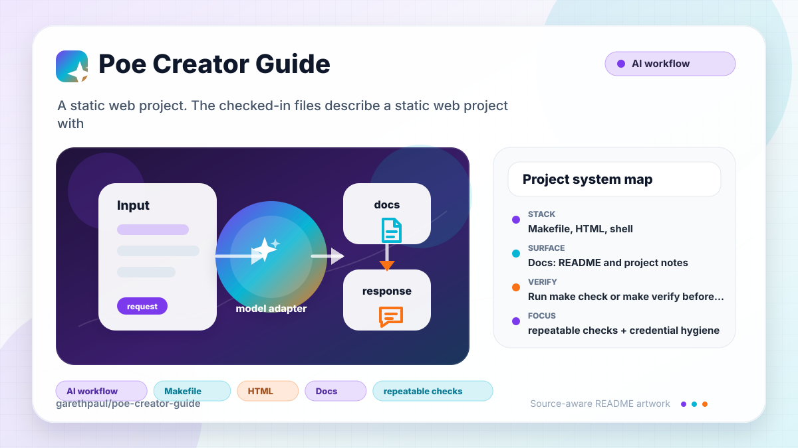

# poe-creator-guide

<!-- README-OVERVIEW-IMAGE -->


## Overview

`garethpaul/poe-creator-guide` is a static web project. The checked-in files describe a static web project with the structure summarized below.

This README is based on the checked-in source, manifests, scripts, and repository metadata on the `main` branch. The project language mix found during review was: no dominant source language detected.

## Repository Contents

- `README.md` - project overview and local usage notes
- `CHANGES.md` - notable maintenance changes
- `Makefile` - local verification entry points
- `.github/workflows/check.yml` - hosted offline documentation validation
- `docs` - source or example code
- `index.md` and `index.html` - local documentation entry points
- `llms.txt` - LLM-oriented source index
- `docs/plans` - canonical completed maintenance plans
- `plans` - earlier completed maintenance plans retained for history
- `scripts` - deterministic docs validation checks
- `SECURITY.md` - security reporting and disclosure guidance
- `VISION.md` - project direction and maintenance guardrails

Additional scan context:

- Source directories: docs, scripts
- Dependency and build manifests: Makefile
- Entry points or build surfaces: Makefile, index.html, index.md, llms.txt
- Test-looking files: scripts/check-docs-index.sh, docs/poe-protocol-specification.md

## Getting Started

### Prerequisites

- Git
- POSIX shell and `make`

### Setup

```bash
git clone https://github.com/garethpaul/poe-creator-guide.git
cd poe-creator-guide
```

The setup commands above are derived from repository files. Legacy mobile, Python, or JavaScript samples may require older SDKs or package versions than a modern workstation uses by default.

## Running or Using the Project

- Open `index.md` for the local Markdown index, or `index.html` for the GitHub Pages redirect.
- Read `llms.txt` for source URLs and short page summaries.
- Read `docs/sources.tsv` for the reviewed mapping from stable local slugs to
  canonical upstream Poe URLs, the last live-verification date, and mirrored content fingerprints. Refresh a row's SHA-256 whenever its local page changes.

## Testing and Verification

- Run `make check` or `make verify` before committing documentation index changes.
- Run `make check-sources` when intentionally auditing current upstream source
  availability; it validates the complete manifest and every local fingerprint
  against regular, non-symlink mirrors before contacting Poe, then follows
  redirects and requires each canonical manifest URL to return HTTP 200 without
  redirecting.
- Run `make record-refresh SLUG=<slug> VERIFIED_AT=<YYYY-MM-DD>` after manually
  reviewing and updating one mirrored page.
- `make test` includes docs-index fixture tests plus network-free live source audit tests
  that inject a fake curl client and exercise success, failure, redirect,
  fingerprint, malformed manifest, unsafe slug, noncanonical URL,
  dot-segment URL, and preflight-ordering paths.
- Pinned, credential-free, read-only GitHub Actions runs the same
  dependency-free `make check` gate for pushes to `main`, pull requests, and
  manual dispatches.
- Run `make build` for the static documentation build gate; it uses the same
  offline docs validator as `make lint`.
- The verification gate runs `scripts/check-docs-index.sh`, which confirms every `docs/*.md` page is represented by both `llms.txt` and `index.md`, each mirrored page matches its reviewed SHA-256 fingerprint and source attribution, each page's source URL remains visible in `index.md`, each index entry keeps the local page link paired with its canonical source link, local `/docs/<slug>` links point to checked-in pages, and `docs/plans/` contains a completed maintenance plan.
- The same gate rejects unexpected hosted files or symbolic links under
  `docs/` and rejects raw active Markdown HTML outside fenced code blocks.
- The same gate validates canonical Poe source URLs with a shared helper so
  dot segments, encoded paths, query strings, fragments, and non-docs hosts do
  not enter the offline manifest, live audit, or refresh recorder.
- The source attribution guard requires exactly one source comment as the first
  line of each mirrored page.
- The same gate requires unique visible `llms.txt` titles so similarly named
  source pages stay distinguishable for local browsing and LLM-oriented use.
- The same gate requires unique `llms.txt` source URLs so a mirrored source
  page cannot be listed twice with conflicting summaries.
- The same gate validates `index.html` redirect links so the GitHub Pages entry
  point cannot drift to a missing mirrored document.
- The same gate requires all `index.html` redirect references to point to one
  mirrored document so refresh, canonical, and fallback links cannot diverge.
- The same gate keeps local index links paired with their canonical Poe source
  links so source attributions cannot be shuffled across pages.
- The same gate rejects Poe source URLs in `index.md` that do not resolve to a
  checked-in mirrored page.
- The same gate rejects duplicate local or source entries in `index.md` so the
  table of contents cannot list a mirrored page twice with conflicting context.
- Local documentation heading fragments are validated offline for both ATX and
  Setext headings.
- Legacy `doc:` and parent-relative Markdown guide links are rejected so local
  navigation consistently uses validated `/docs/...` targets.
- The validator also protects the hosted workflow contract: read-only
  permissions, a pinned checkout action, and the canonical `make check` command.

## Refreshing a Mirror

Use this mirror refresh process for one reviewed page at a time:

1. Open the canonical URL already recorded for the slug in `docs/sources.tsv`.
2. Compare it with `docs/<slug>.md` and manually apply only reviewed source
   changes. Preserve the exact canonical `<!-- Source: ... -->` comment as the
   first line.
3. Run `make record-refresh SLUG=<slug> VERIFIED_AT=<YYYY-MM-DD>`. The recorder
   validates the slug, date, unique manifest row, regular non-symlink mirror,
   and attribution, then atomically updates only that row's date and SHA-256
   fingerprint.
4. Inspect the mirror and manifest diff and run `make check`. Run
   `make check-sources` separately only when live verification is intended.

The recorder never downloads or replaces prose, infers canonical URLs, adds
manifest rows, or contacts Poe. New pages and URL changes require explicit
reviewed edits to the manifest, index, and `llms.txt`.

When the required SDK or runtime is unavailable, use static checks and source review first, then verify on a machine that has the matching platform toolchain.

## Configuration and Secrets

- Detected references to OpenAI. Keep API keys, OAuth credentials, tokens, and account-specific values in local configuration only.

## Security and Privacy Notes

- Review changes touching authentication or token handling; examples from the scan include docs/fastapi_poe-python-reference.md, docs/how-we-cover-your-costs.md, docs/poe-protocol-specification.md, docs/quick-start.md, and 1 more.
- Review changes touching external API calls or credential-adjacent configuration; examples from the scan include docs/accessing-other-bots-on-poe.md, docs/examples.md, docs/fastapi_poe-python-reference.md, docs/poe-protocol-specification.md, and 3 more.
- Review changes touching network requests, sockets, or service endpoints; examples from the scan include _config.yml, docs/accessing-other-bots-on-poe.md, docs/best-practices-for-video-generation-prompts.md, docs/best-practices-image-generation-bots.md, and 6 more.
- Review changes touching file, media, JSON, XML, CSV, OCR, or data parsing; examples from the scan include docs/accessing-other-bots-on-poe.md, docs/best-practice-text-generation.md, docs/best-practices-for-video-generation-prompts.md, docs/best-practices-image-generation-bots.md, and 6 more.
- Review changes touching database, model, or persistence code; examples from the scan include docs/best-practice-text-generation.md, docs/canvas-app-quick-start.md, docs/fastapi_poe-python-reference.md, docs/how-to-get-distribution.md, and 5 more.

## Maintenance Notes

- See `SECURITY.md` for vulnerability reporting and safe research guidance.
- See `VISION.md` for project direction and contribution guardrails.
- See `CHANGES.md` for maintenance history.
- See `docs/plans/2026-06-08-docs-plan-location-baseline.md` for the canonical
  docs-plan baseline and `plans/` for earlier historical plans.
- See `docs/plans/2026-06-09-index-html-redirect-validation.md` for the
  `index.html` redirect validation guard.
- See `docs/plans/2026-06-10-index-html-target-consistency.md` for the
  `index.html` single-target redirect guard.
- See `docs/plans/2026-06-09-llms-title-disambiguation.md` for the
  `llms.txt` duplicate-title guard.
- See `docs/plans/2026-06-09-llms-url-deduplication.md` for the `llms.txt`
  duplicate source URL guard.
- See `docs/plans/2026-06-09-index-source-pair-validation.md` for the
  local/source link pairing guard in `index.md`.
- See `docs/plans/2026-06-09-index-source-url-validation.md` for the reverse
  source-URL guard and static `make build` gate.
- See `docs/plans/2026-06-09-index-entry-deduplication.md` for the duplicate
  `index.md` entry guard.
- See `docs/plans/2026-06-09-page-source-attribution.md` for the
  per-page source attribution guard.
- See `docs/plans/2026-06-09-first-line-source-attribution.md` for the
  first-line attribution placement guard.
- See `docs/plans/2026-06-10-ci-baseline.md` for the GitHub Actions baseline.
- See `docs/plans/2026-06-10-hosted-docs-validation.md` for the pinned,
  read-only hosted validation boundary.
- See `docs/plans/2026-06-12-legacy-local-link-validation.md` for normalized
  mirrored guide links and the legacy-link guard.
- See `docs/plans/2026-06-12-canonical-source-manifest.md` for canonical source
  mapping and the opt-in live availability audit.
- See `docs/plans/2026-06-19-hosted-content-boundary.md` for the hosted-file,
  active-content, and canonical source URL path boundary.

## Contributing

Keep changes small and tied to the project that is already present in this repository. For code changes, document the toolchain used, avoid committing generated dependency directories or local configuration, and update this README when setup or verification steps change.
